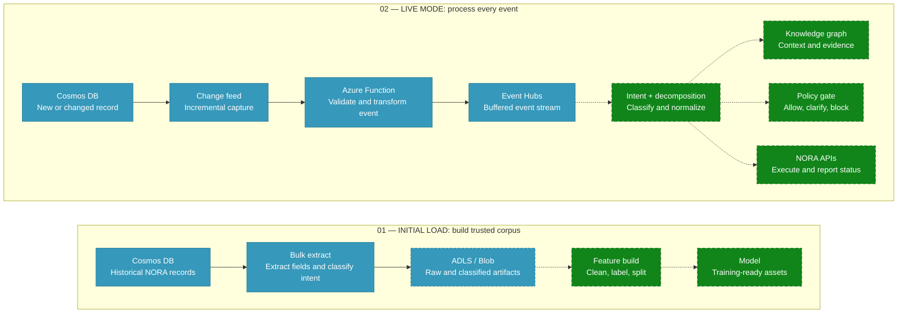

# Technical design

## Design principles

- Keep the implementation small and readable.
- Preserve source records before transforming them.
- Prefer explicit identifiers over probabilistic joins.
- Separate extraction mode from downstream platform choice.

## Components

`app.py` contains four small responsibilities:

- Cosmos querying and identifier discovery.
- Interaction assembly.
- Complete CSV/JSONL logging.
- Mode-specific LLM or graph export.
- Single-ID or dataset orchestration with per-ID failure logging.
- Complete-only filtering after all four source queries finish.

`DefaultAzureCredential` chooses the available identity source. Locally this is normally Azure CLI; in Azure it should be managed identity or workload identity.

## NORA Intent Finder event flow

The following diagram records the target design shown in the architecture flow.
Solid green and blue stages are implemented; dashed stages are planned. Blob/ADLS
export is implemented but remains optional through configuration.

### Configuration-driven execution

`intent_app.py` is the common entry point. `INITIAL_LOAD_ENABLED` and
`STREAM_LOAD_ENABLED` support initial-only, stream-only, or initial-then-stream
execution. When both flags are true, the finite historical load completes before
the blocking Azure Functions host starts.

The initial flow reads all source records or an inclusive `_ts` timeframe,
classifies them, writes local CSV/JSONL artifacts, and optionally uploads those
artifacts to Blob Storage or ADLS Gen2. The current training manifest and log are
explicit placeholders; feature engineering and model training are not executed.

The live flow uses Cosmos lease containers for checkpoints. Four change-feed
triggers publish compact identifier-only events to Event Hubs. The Event Hubs
subscriber currently validates and logs each event. Live intent classification,
knowledge-graph enrichment, policy decisions, and NORA API execution remain
planned downstream stages.

## Query design

The pipeline performs cross-partition parameterized queries because partition keys were not provided. Chat CIDs are enumerated from `messages[].data.cid` and matched to `context-history-all-tools.cid`. Run IDs from those records query `context-history-uat.run_id`. Feedback uses an `EXISTS` subquery with `ARRAY_CONTAINS` against `feedbacks[].cid_list`. Dataset mode reuses one Cosmos client and streams IDs in bounded in-memory batches, but still performs queries per interaction. This is suitable for validation; high-volume production ingestion should use known partition keys, bulk concurrency, or the Cosmos change feed.

Complete-only filtering happens after correlation. An interaction is saved only when all four assembled lists are non-empty. A missing source is a normal skip; query or export exceptions remain failures.

## Failure behavior

- Missing endpoint or argument: show usage and exit before connecting.
- Chat not found: record a clear failure for that interaction.
- Authentication, authorization, throttling, network, and export errors inside an interaction: record the error in `failed_interactions.csv` and continue.
- Failure to connect or enumerate chat CIDs: stop the run because there is no correlation key to process.
- Unknown ingestion mode: write the base logs, record each attempted interaction as failed, and continue.

## Idempotency

Files are append-only, so rerunning an ID or dataset creates duplicate rows. This is useful for audit history but not idempotent dataset creation. Production ingestion should add a run ID, deduplication step, or overwrite policy.

## Future design options

- Connect the Event Hubs subscriber to live intent classification and decomposition.
- Add a durable initial-load watermark and deduplication across the batch/stream boundary.
- Implement feature engineering and model training from the ADLS/Blob corpus.
- Add knowledge-graph, policy-gate, and NORA API adapters.
- Add schema validation before export.
- Add a redaction layer before LLM output.
